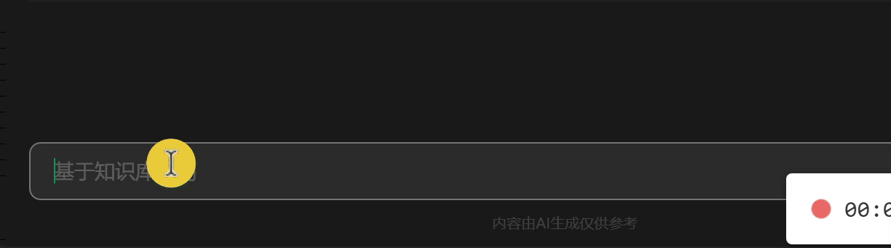
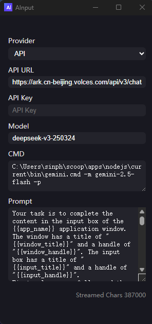

# ainput

> ainput 是一款支持智能候选的 AI 驱动全局输入法。  
>
> ainput 支持多种大模型服务和本地 AI 工具，提供输入历史、剪贴板等上下文的智能候选，配置灵活，注重隐私。
> ⚠️ 本项目涉及输入内容、窗口信息等数据上传至大模型服务商，详见下文"隐私声明"

---

## 需求背景

- 在任意输入框输入拼音或任意文本，自动弹出 AI 智能候选
- 多屏/高DPI 环境下，候选框总能精准跟随输入框
- 输入历史、剪贴板内容智能融合，提升输入效率

---

## 使用示例

- **AI 智能候选**  


- **修改配置**



完整配置见[config.toml](https://github.com/alvinfunborn/ainput/blob/main/src-tauri/config.toml)

---

## 实现原理

ainput 的核心能力依赖于 Windows UI Automation —— 微软官方提供的自动化API，能够跨进程、跨窗口地枚举所有UI控件（如按钮、文本框、窗口、菜单等）。

本项目通过 Tauri 后端（Rust）集成 Windows UI Automation，主要流程如下：

- 利用 Rust 的 `windows` crate 调用 UI Automation COM 接口，获取聚焦桌面窗口和控件
- 获取每个控件的类型（ControlType）、名称、可见性、可交互性、屏幕坐标、窗口层级等属性
- 结合自定义控件类型映射和过滤规则，生成 AI 候选点
- 后端将控件信息和 AI 候选点数据传递给前端/Overlay 进行渲染和交互

通过 Windows UI Automation，ainput 能够实现对所有可见窗口和控件的精准捕捉和操作，为全局 AI 候选提供底层支撑。

---

## 安装与使用

##### 方式一：直接下载

1. 前往 [Releases 页面](https://github.com/alvinfunborn/ainput/releases) 下载最新的 `ainput.exe` 和 `config.toml` 文件。
2. 将二者放在同一目录下，修改config.toml添加AI服务接入方式，双击运行 `ainput.exe`。
3. 托盘会出现 ainput 图标，可右键设置。
4. 如需自定义配置，编辑 `config.toml`，保存后重启生效。

##### 方式二：源码编译运行

```bash
# 克隆仓库
git clone https://github.com/alvinfunborn/ainput.git
cd ainput

# 安装依赖
npm install

# 构建 Tauri 后端
cd src-tauri
cargo build

# 开发模式启动
cd ..
npm run tauri dev
```

- 配置详见 `src-tauri/config.toml`
- 支持托盘、开机自启、快捷键自定义

---

## AI服务接入模式

ainput 支持两种大模型调用模式，用户可根据自身需求和已购服务自由选择：

- **API模式**  
  通过 HTTP API 调用大模型服务（OpenAI大模型API接口定义服务商，如 OpenAI、火山方舟、阿里云百炼 等），需在 `config.toml` 中配置 API Key。适用于拥有相关 API 权限的用户。

- **CMD模式**  
  通过本机命令行工具（如 `gemini-cli`）调用大模型。适用于已安装并配置好命令行 AI 工具，有结合本机系统能力需求的用户。  
  > **注意：** 若使用 `gemini-cli`，请确保已在本机命令行中完成登录（如运行 `gemini`），否则无法正常生成候选。

可在 `config.toml` 中通过 `ai_client.provider` 字段选择模式，并配置相应参数。

---

## 默认快捷键

- 候选框激活时
  - Tab：选择候选词
  - 1: 选择候选词的第一个字
  - Esc：关闭候选框
- 其它快捷键可在配置中自定义

---

## 性能

- **内存占用**：常驻后台时约 10MB。
- **CPU 占用**：即使频繁扫描 UI，空闲时 CPU 占用通常低于 1%。
- **启动速度**：大多数现代设备下启动时间小于 1 秒。
- **后台线程**：仅有少量轻量线程用于 UI Automation 和事件钩子。

---

## 安全性

- 开源可审计，无后门
- 仅需普通用户权限

## 隐私声明

ainput 在生成 AI 候选词时，会采集并上传如下信息到大模型服务商：
- 当前输入框的内容（你正在输入的文本）
- 当前窗口的应用名、标题、类名、坐标等
- 输入历史（部分内容）
- 剪贴板内容（部分场景）

这些信息会被拼接为 prompt/context，发送到远程 AI 服务，用于生成候选词。

**隐私保护现状**：
- 支持通过脱敏正则对部分敏感内容进行脱敏处理
- 可通过 ignore_apps 配置忽略指定应用，不采集其数据
- 但仍可能存在未覆盖的隐私风险，部分敏感信息可能被上传
- 目前尚未实现本地加密或更细粒度的隐私过滤

**用户须知**：
- 使用前请充分了解：你的输入内容、窗口信息、历史、剪贴板等可能会被上传到大模型服务商
- 这些服务商的隐私政策请自行查阅
- 若对隐私有高要求，请勿在敏感场景下使用，或关闭 AI 功能
- 本项目不对因隐私泄露造成的后果负责

---

## 附录

- [Windows Virtual Key Codes](https://docs.microsoft.com/en-us/windows/win32/inputdev/virtual-key-codes)
- [Windows UI Automation](https://learn.microsoft.com/en-us/windows/win32/winauto/uiauto-controltype-ids)
